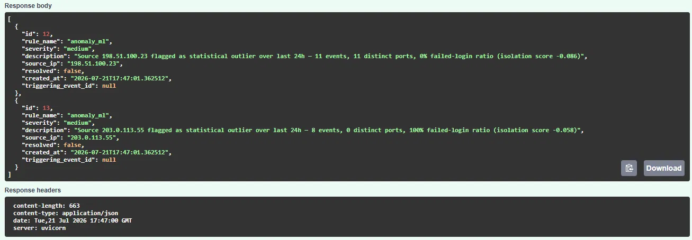

# Secure Log SIEM

A minimal SIEM-style backend: security/log events come in through a REST
API, get checked against a real-time rule engine, and can also be scanned
in batch by an IsolationForest anomaly model. Built to be small enough to
read end-to-end in one sitting, but structured the way a real detection
pipeline is structured.

## Demo

Simulated attack traffic (brute-force login, port scan, suspicious process) gets
caught by the rule engine in real time, and independently confirmed by a
separate batch IsolationForest anomaly scan:



## Why this exists

Most backend portfolio projects are CRUD apps with auth bolted on. This one
is built around an actual security problem: given a stream of events from
things like auth servers, firewalls, and endpoint agents, decide which ones
matter. It combines three things in one codebase — a production-shaped
FastAPI backend, a rule-based detection engine, and a scikit-learn anomaly
model — instead of demoing them separately.

## Architecture

```
                    ┌─────────────────┐
  agents/scripts ──▶│  POST /ingest    │──▶ rule engine (real-time, per-event)
  (log sources)      │  (API-key auth)  │        │
                    └─────────────────┘        ▼
                             │            events + alerts
                             ▼                  table
                        Postgres/SQLite ◀───────┘
                             ▲
              ┌──────────────┼───────────────┐
              │              │               │
       GET /events    GET /alerts    POST /alerts/scan-anomalies
       (JWT auth)     (JWT auth)     (admin-only, batch IsolationForest)
```

**Two detection layers, on purpose, not by accident:**

- **Rule engine** (`app/detection/rules.py`) runs synchronously on every
  ingested event. Rules like "5+ failed logins from one IP in 60s" are
  meaningful with zero surrounding context, so they run in real time and
  every alert is traceable to one plain-English condition.
- **Anomaly model** (`app/detection/anomaly.py`) runs as a batch scan, not
  per-event. An IsolationForest score is only meaningful *relative to a
  population* of other sources' behavior in the same window — there's no
  such thing as "this one event is 0.6 anomalous" in isolation. So it's
  exposed as an on-demand/admin endpoint (and in production would also run
  on a schedule), not wired into the ingest path.

This split is the main design decision in the project and the one worth
being able to explain in an interview.

## Stack

- **FastAPI** + Pydantic v2 for the API and validation
- **SQLAlchemy 2.0** ORM, SQLite for local dev / Postgres for docker-compose
- **python-jose** + **passlib/bcrypt** for JWT auth (users) and a separate
  API-key header (machine agents) — different auth models for different
  callers, not one-size-fits-all
- **scikit-learn** (IsolationForest) + **pandas** for the anomaly scan
- **pytest** + FastAPI's `TestClient` for tests

## Running it

### Option A — local, sqlite, fastest path

```bash
python -m venv venv && source venv/bin/activate
pip install -r requirements.txt
uvicorn app.main:app --reload
```

API docs: http://localhost:8000/docs

### Option B — docker-compose, Postgres, closer to production

```bash
docker-compose up --build
```

### Try it end-to-end

```bash
# Populate normal traffic + a simulated brute-force attack, port scan,
# and suspicious-process event, then trigger alerts:
python scripts/seed_demo_data.py

# Register a user (first user registered becomes admin), get a token, and browse:
curl -X POST localhost:8000/auth/register -H "Content-Type: application/json" \
  -d '{"username":"me","password":"password123"}'
curl -X POST localhost:8000/auth/login -d "username=me&password=password123"
curl localhost:8000/alerts -H "Authorization: Bearer <token>"

# Run the batch anomaly scan (admin token required):
curl -X POST localhost:8000/alerts/scan-anomalies -H "Authorization: Bearer <token>"
```

### Tests

```bash
pytest tests/ -v
```

## API surface

| Endpoint | Auth | Purpose |
|---|---|---|
| `POST /auth/register` | none | Create a user (first user = admin) |
| `POST /auth/login` | none | Get a JWT |
| `POST /ingest` | API key header | Push one event or a batch; runs rule engine inline |
| `GET /events` | JWT | Query/filter stored events |
| `GET /alerts` | JWT | Query alerts, filter by resolved/severity |
| `PATCH /alerts/{id}/resolve` | JWT | Mark an alert resolved |
| `POST /alerts/scan-anomalies` | JWT (admin) | Run the IsolationForest batch scan |

## What's deliberately out of scope for this MVP

- **Async queue for ingest.** Right now `/ingest` runs the rule engine
  synchronously before responding. That's fine at low-to-moderate volume
  and keeps the system trivial to reason about. At real production log
  volume, the first change would be to push raw events onto a queue
  (Redis Streams / Kafka) and have a worker run detection, so ingest
  latency doesn't depend on detection latency.
- **Migrations.** Uses `Base.metadata.create_all()` on startup instead of
  Alembic. Fine for a portfolio project; a real deployment needs versioned
  migrations the moment the schema changes after data exists.
- **Distributed rate limiting / IP reputation feeds.** The rule engine is
  intentionally simple and self-contained so it doesn't depend on external
  threat-intel services.
- **Frontend dashboard.** This is a backend portfolio piece by design —
  everything is inspectable through `/docs` (Swagger UI).

## Project layout

```
app/
  main.py              FastAPI app, router wiring
  config.py            Settings (env-driven)
  database.py           SQLAlchemy engine/session
  models.py             ORM models: User, Event, Alert
  schemas.py             Pydantic request/response models
  auth.py                JWT + API-key auth dependencies
  detection/
    rules.py             Real-time rule engine
    anomaly.py            Batch IsolationForest scan
  routers/
    auth_router.py, ingest.py, events.py, alerts.py
scripts/
  seed_demo_data.py       Simulates an attack against a running instance
tests/
  test_ingest.py          End-to-end auth + ingest + alert tests
```
